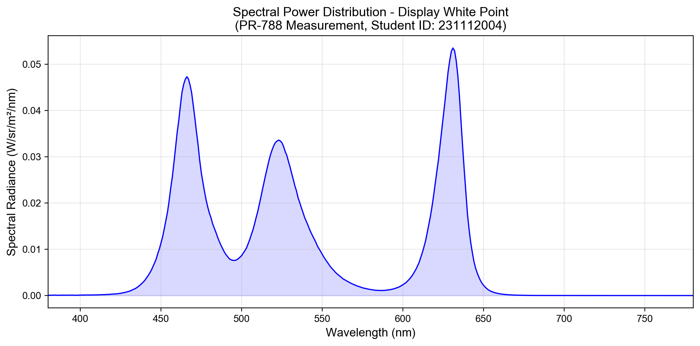
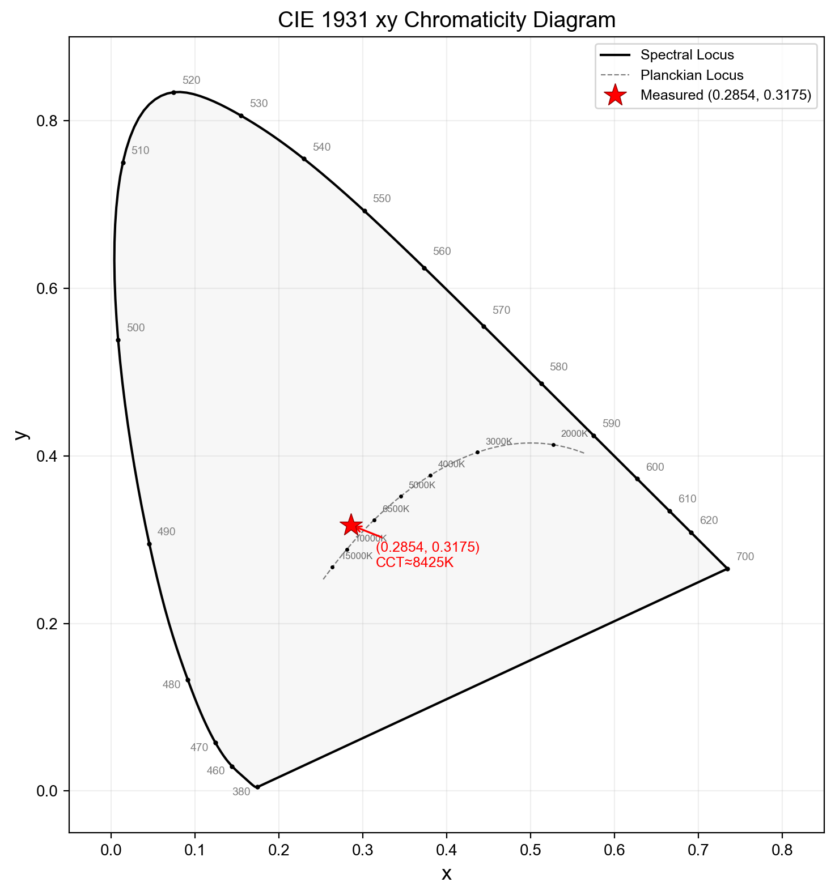
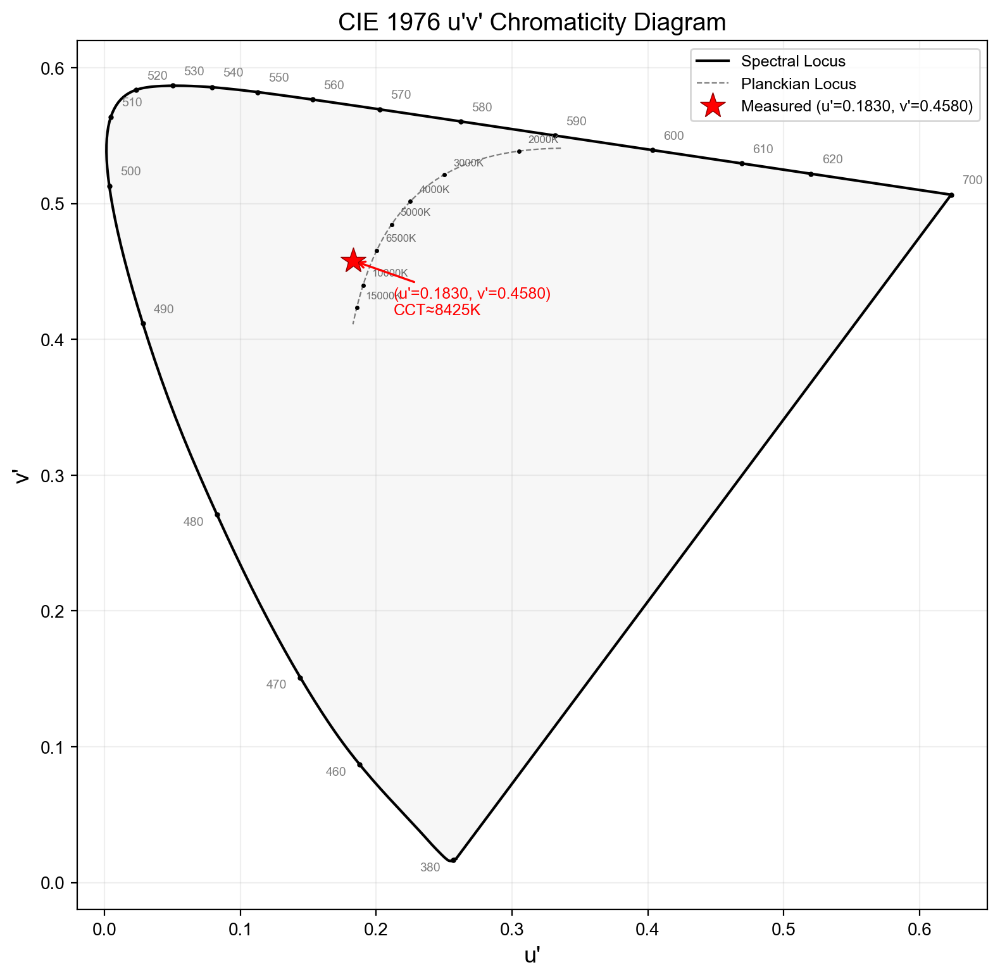

# 色彩科学与应用 — 作业 1.1  三刺激值计算报告

- **学号**: 231112004
- **姓名**: 姜淏
- **测量设备**: PhotoResearch PR-788 光谱辐射度计
- **测量对象**: 显示屏白场 (White Point)

---

## 结果概览

| 计算项目 | 结果 |
|---------|------|
| CIE 1931 XYZ | X = 822.9879,  Y = 915.6386 cd/m²,  Z = 1145.2742 |
| CIE 1931 xy | x = 0.2854,  y = 0.3175 |
| CIE 1976 u'v' | u' = 0.1830,  v' = 0.4580 |
| CCT (Robertson) | 8425 K |

---

## 一、原始测量数据

使用 PhotoResearch PR-788 光谱辐射度计对某显示屏白场进行测量，获得 380–780 nm 波长范围内的光谱功率分布 (SPD) 数据。PR-788 的波长分辨率为 1 nm，光谱带宽可选 2/5/8 nm，测量结果为光谱辐亮度 (spectral radiance)，单位为 W/sr/m²/nm。

| 参数 | 值 |
|------|-----|
| 波长范围 | 380 – 780 nm |
| 波长间隔 (Δλ) | 1 nm |
| 数据点数 | 401 |
| SPD 最大值 | 5.3500e-02 W/sr/m²/nm (λ ≈ 631 nm) |
| SPD 最小值 | 4.9500e-06 W/sr/m²/nm |



*图 1: PR-788 测量的显示屏白场光谱功率分布。可见典型 LED 背光 LCD 特征——蓝光区 (~450 nm) 和红光区 (~630 nm) 各有显著峰值，绿光区 (~530 nm) 有宽峰。*

---

## 二、CIE 1931 XYZ 三刺激值计算

### 2.1 颜色匹配函数 (CMFs)

CIE 1931 2° 标准观察者颜色匹配函数 x̄(λ)、ȳ(λ)、z̄(λ) 数据来源于 CVRL (Colour & Vision Research Laboratory) 数据库 (http://cvrl.ioo.ucl.ac.uk/cmfs.htm)，采用 1 nm 间隔的离散数据，与 CIE 015:2018 标准一致。

### 2.2 计算公式

对于自发光光源（如显示屏），三刺激值计算公式为（离散求和形式）：

$$X = K_m \times \sum_{\lambda=380}^{780} S(\lambda) \cdot \bar{x}(\lambda) \cdot \Delta\lambda$$

$$Y = K_m \times \sum_{\lambda=380}^{780} S(\lambda) \cdot \bar{y}(\lambda) \cdot \Delta\lambda$$

$$Z = K_m \times \sum_{\lambda=380}^{780} S(\lambda) \cdot \bar{z}(\lambda) \cdot \Delta\lambda$$

其中：
- $S(\lambda)$ = 光谱辐亮度 (W/sr/m²/nm)，由 PR-788 测量
- $\bar{x}(\lambda), \bar{y}(\lambda), \bar{z}(\lambda)$ = CIE 1931 2° 标准观察者颜色匹配函数
- $\Delta\lambda = 1$ nm（波长间隔）
- $K_m = 683$ lm/W（明视觉最大光谱光视效能）
- 参考: PR-7XX User Manual, Chapter 3, p.32; CIE 015:2018

### 2.3 中间计算值

| λ (nm) | S(λ) (W/sr/m²/nm) | S(λ)×x̄(λ) | S(λ)×ȳ(λ) | S(λ)×z̄(λ) |
|-------:|-------------------:|------------:|------------:|------------:|
| 380 | 9.0800e-05 | 1.2421e-07 | 3.5412e-09 | 5.8566e-07 |
| 420 | 3.2600e-04 | 4.3808e-05 | 1.3040e-06 | 2.1047e-04 |
| 460 | 3.5200e-02 | 1.0236e-02 | 2.1120e-03 | 5.8756e-02 |
| 500 | 8.6500e-03 | 4.2385e-05 | 2.7939e-03 | 2.3528e-03 |
| 540 | 1.6100e-02 | 4.6754e-03 | 1.5359e-02 | 3.2683e-04 |
| 580 | 1.3100e-03 | 1.2004e-03 | 1.1397e-03 | 2.1615e-06 |
| 620 | 2.4200e-02 | 2.0678e-02 | 9.2202e-03 | 4.5980e-06 |
| 660 | 3.9000e-04 | 6.4311e-05 | 2.3790e-05 | 0.0000e+00 |
| 700 | 1.1600e-05 | 1.3177e-07 | 4.7583e-08 | 0.0000e+00 |
| 740 | 8.1400e-06 | 5.6172e-09 | 2.0285e-09 | 0.0000e+00 |
| 780 | 8.8800e-06 | 3.6861e-10 | 1.3311e-10 | 0.0000e+00 |
| **Sum** | — | **1.204960e+00** | **1.340613e+00** | **1.676829e+00** |

### 2.4 计算结果

```
Σ S(λ)×x̄(λ)×Δλ = 1.204960e+00
Σ S(λ)×ȳ(λ)×Δλ = 1.340613e+00
Σ S(λ)×z̄(λ)×Δλ = 1.676829e+00
```

- **X** = 683 × 1.204960e+00 = **822.9879**
- **Y** = 683 × 1.340613e+00 = **915.6386** cd/m²
- **Z** = 683 × 1.676829e+00 = **1145.2742**

### 2.5 关于 Y 值标准化的讨论

**思路 A（本报告采用）：绝对三刺激值**
直接使用 Km = 683 lm/W，此时 Y 即为绝对亮度 (luminance) = 915.6386 cd/m²，具有明确物理意义。这是 PR-788 等光谱辐射度计的标准做法，与仪器手册 (Chapter 3, p.32) 中给出的公式一致。

**思路 B：相对三刺激值 (Y = 100)**
将三刺激值归一化使 Y = 100。归一化系数 k = 100/915.6386 = 0.109213。此时 X = 89.8813，Y = 100.0000，Z = 125.0793。此思路常用于反射/透射物体色的表达，其中 Y=100 表示完美漫反射体。对于自发光体，此标准化会丢失绝对亮度信息。

**思路 C：K = 1（无物理单位）**
省略 Km 系数，直接对 S(λ)×CMF×Δλ 求和。此时三刺激值无特定物理单位，仅为相对量。虽然色品坐标 (x, y) 和 (u', v') 不受 K 值影响，但三刺激值本身缺乏物理意义。

---

## 三、CIE 1931 xy 色品坐标

### 3.1 计算公式与过程

$$x = \frac{X}{X+Y+Z}, \quad y = \frac{Y}{X+Y+Z}$$

```
X + Y + Z = 822.9879 + 915.6386 + 1145.2742 = 2883.9007
x = 822.9879 / 2883.9007 = 0.2854
y = 915.6386 / 2883.9007 = 0.3175
```

**结果: x = 0.2854,  y = 0.3175**

### 3.2 CIE 1931 xy 色品图



*图 2: CIE 1931 xy 色品图。红色星号标注测量点 (x=0.2854, y=0.3175)，位于普朗克轨迹附近，对应约 8425 K 色温的冷白色区域。*

---

## 四、CIE 1976 u'v' 色品坐标

### 4.1 计算公式与过程

$$u' = \frac{4X}{X+15Y+3Z}, \quad v' = \frac{9Y}{X+15Y+3Z}$$

```
X + 15Y + 3Z = 822.9879 + 15×915.6386 + 3×1145.2742 = 17993.3892
u' = 4×822.9879 / 17993.3892 = 0.1830
v' = 9×915.6386 / 17993.3892 = 0.4580
```

**结果: u' = 0.1830,  v' = 0.4580**

CIE 1976 u'v' 均匀色品空间 (UCS) 相对于 CIE 1931 xy 色品图具有更好的感知均匀性。

### 4.2 CIE 1976 u'v' 色品图



*图 3: CIE 1976 u'v' 色品图。红色星号标注测量点 (u'=0.1830, v'=0.4580)。*

---

## 五、相关色温 (CCT) 计算

相关色温 (Correlated Color Temperature, CCT) 是指与被测光源色品坐标最接近的普朗克辐射体 (黑体) 温度。本报告采用三种算法进行计算和交叉验证。

### 5.1 McCamy 近似公式 (1992)

> McCamy, C.S. (1992). *Correlated color temperature as an explicit function of chromaticity coordinates.* Color Res. Appl., 17(2), 142–144.

$$n = \frac{x - 0.3320}{y - 0.1858}, \quad CCT = -449n^3 + 3525n^2 - 6823.3n + 5520.33$$

```
n = (0.2854 - 0.3320) / (0.3175 - 0.1858) = -0.354038
CCT = 8397.80 K
```

### 5.2 Hernandez-Andres 近似公式 (1999)

> Hernandez-Andres, J. et al. (1999). *Calculating correlated color temperatures across the entire gamut of daylight and skylight chromaticities.* Appl. Opt., 38(27), 5703–5709.

$$n = \frac{x - x_e}{y - y_e}, \quad CCT = A_0 + A_1 e^{-n/t_1} + A_2 e^{-n/t_2} + A_3 e^{-n/t_3}$$

CCT = 8419.51 K

### 5.3 Robertson 方法 (1968)（本报告采用）

> Robertson, A.R. (1968). *Computation of correlated color temperature and distribution temperature.* J. Opt. Soc. Am., 58(11), 1528–1535.

Robertson 方法在 CIE 1960 UCS (u, v) 色品图上，使用 31 个普朗克轨迹参考点的查找表和线性插值。该方法是 CIE 推荐的经典 CCT 计算方法。

```
CIE 1960 UCS: u = 0.182953,  v = 0.305325
CCT = 8424.51 K
```

### 5.4 CCT 计算结果汇总

| 算法 | CCT (K) | 适用范围 | 备注 |
|------|---------|---------|------|
| McCamy (1992) | 8398 | 2000–12500 K | 三次多项式近似 |
| Hernandez-Andres (1999) | 8420 | 3000–50000 K | 指数函数近似 |
| **Robertson (1968)** | **8425** | 1000–∞ K | **CIE 推荐，查找表插值** |

三种方法结果高度一致（偏差 < 30 K），最终采用 Robertson 方法：**CCT = 8425 K**。此色温属于冷白色，略偏蓝，高于标准 D65 光源的 6504 K。

---

## 六、参考文献

1. CIE 015:2018, Colorimetry, 4th Edition.
2. McCamy, C.S. (1992). Correlated color temperature as an explicit function of chromaticity coordinates. *Color Research & Application*, 17(2), 142–144.
3. Hernandez-Andres, J., Lee, R.L., Romero, J. (1999). Calculating correlated color temperatures across the entire gamut of daylight and skylight chromaticities. *Applied Optics*, 38(27), 5703–5709.
4. Robertson, A.R. (1968). Computation of correlated color temperature and distribution temperature. *J. Opt. Soc. Am.*, 58(11), 1528–1535.
5. CVRL - Colour & Vision Research Laboratory. CIE 1931 2° CMFs. http://cvrl.ioo.ucl.ac.uk/cmfs.htm
6. PhotoResearch PR-7XX SpectraScan User's Manual. Novanta/JADAK, 2019.
7. Lindbloom, B. Useful Color Equations. http://www.brucelindbloom.com/
